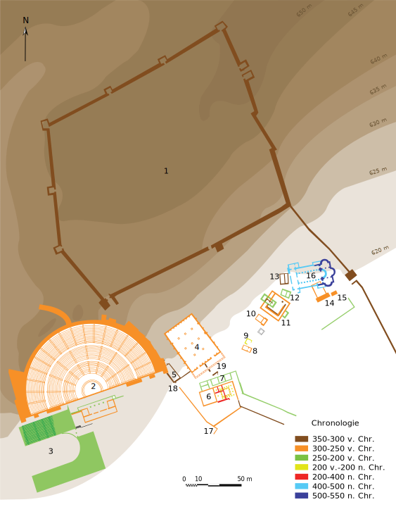

Het **orakel van Dodona** (Oudgrieks: Δωδώνη / Dôdốnê) met een eikenbos en een tempel was gewijd aan Zeus Naios en de moedergodin, hier vereerd onder de naam van Dione. Het lag in Epirus aan de voet van het gebergte Tomarós ten zuiden van het Pambotismeer, 22 km ten zuiden van Ioannina. Het was volgens Herodotus het oudste orakel van het oude Griekenland, dat mogelijk terugging tot het 2e millennium v.Chr., en het beroemdste na dat van het Apollo-orakel van Delphi. Hier zouden ook de Zeus-Naia-spelen plaatsvinden. De priesters en priesteressen van het heilige bos zouden het geruis van de wind door de bladeren van de eiken interpreteren en mogelijk ook het koeren van de duiven in de heilige eik. Gelegen aan de grens van het oude Griekenland en haar poleis, had het te lijden onder de ontwikkeling van het orakel te Delphi in de klassieke periode, maar bleef het toch belangrijk tot de Romeinse periode.

## Oorsprong

De berichten omtrent de oorsprong van deze godspraak zijn zeer verschillend. De priester van Zeus in het Egyptische Thebe zei dat de Feniciërs van daar twee heilige vrouwen hadden geroofd en de ene in Lybië en de andere aan de Grieken hadden verkocht, waarop de eerste het Orakel van Zeus-Amon, de tweede dat te Dodona zou hebben gesticht.

Een ander verhaal meldde dat twee zwarte wilde duiven uit Thebe in Egypte waren weggevlogen, waarvan de ene in Libië was gebleven en de andere zich te Dodona op een eik had neergezet en met een menselijke stem had bevolen hier een orakel te stichten.

## Geschiedenis

De eerste sporen van een nederzetting uit de Bronstijd gaan terug tot het eind van het 3e millennium v.Chr. Vanaf deze tijd schijnt de plaats tot in de 6e eeuw n.Chr. door mensen bewoond te zijn geweest. Reeds voor de 8e eeuw v.Chr. en eventueel al in de Laat-Myceense tijd schijnt er een Zeuscultus op deze plaats te zijn gepraktiseerd, zoals een vers uit Homerus' Ilias (XVI 233.) doet vermoeden. Vanaf de 8e eeuw v.Chr. stond waarschijnlijk een kring van bronzen drievoeten om de Zeuseik. Om 400 v.Chr. werd bij de eik het zogenaamde heilige huis opgericht, dat vermoedelijk voor het onderbrengen van wijgeschenken diende. Bij het begin van de 3e eeuw v.Chr. werd het Zeusheiligdom met meerdere gebouwen, o.a. het theater, het bouleuterion en later het stadion, uitgebreid, wat met het toegenomen belang van het heiligdom onder de Molossische koning Pyrrhos samenhangt. Sinds Pyrrhos werden ook wedkampen, de Naia-spelen, uitgedragen. Na de Val van Pyrrhos 243/2 v.Chr. diende Dodona waarschijnlijk ook als zetel van de koinon van de Epiroten.

In 219 v.Chr. werden stad en tempel door een woeste Aetolische krijgsbende onder aanvoering van Dorimachos geplunderd en grotendeels vernield. Onder de Romeinse heerschappij kwijnde Dodona. Toch bleef de heilige eik nog bestaan en werden er nog orakels gegeven. Van keizer Julianus Apostata (361 -363 na Chr.) wordt gemeld dat hij de god nog raadpleegde vóór zijn tocht tegen Perzië. Theodosius de Grote (379 - 395) schijnt het te hebben opgeheven.

## Het orakel

Zeus openbaarde zich door de aan hem gewijde eik, in het ruisen van de wind in de dichte bladerkroon, waaraan priesters (Solloi of Helloi), later priesteressen, de uitleg gaven. Zij maakten de wil van de god ook op uit het geruis van een aan de voet van de eik opwellende bron, misschien ook uit de klank van een op een voetstuk geplaatst metalen bekken; vlak daarbij stond op een ander voetstuk het beeld van een knaap met een zweep in de hand. Door de veelvuldige winden die in de omtrek van de tempel plachten te waaien, werd de zweep tegen het bekken aangeslagen en het schijnt dat uit de hierdoor voortgebrachte geluiden de wil van de god werd opgemaakt.

De priesteressen in de tempel van Dodona droegen de naam van Peleiades, d.i. "duiven", een naam die wellicht voor een deel de aanleiding is geweest tot het ontstaan van de hierboven vermelde legende van het orakel.

## Vereerde goden

De echtgenote van Zeus heette in de hem hier bewezen eredienst Dione. Hun dochter was Aphrodite. In de oudste tijd althans was de Pelasgische of Dodonaiïsche Zeus, zoals hij werd vereerd te Dodona, een zuivere natuurgod, die in de hemel leefde en de bevruchtende regen op de aarde liet neerstromen. Een eigenaardige godsdienstvorm, welke uit die oudste tijden was overgebleven, bestond hierin dat de priesters van deze god hun voeten niet mochten wassen en op de grond moesten slapen. Het schijnt dat er, toen zij later door priesteressen werden vervangen, toch ook nog mannen aan de tempeldienst bleven verbonden.

Toen later het orakel van Delphi het voornaamste werd in de gehele Griekse wereld, bleef dat van Dodona toch zijn aanzien behouden en werd het nog dikwijls geraadpleegd door verschillende staten en personen.

## Bronnen

Orakel van Dodona. (2021, juli 8). Wikipedia, de vrije encyclopedie. Opgehaald 15:01, juli 31, 2023 van https://nl.wikipedia.org/w/index.php?title=Orakel_van_Dodona&oldid=59470769.
